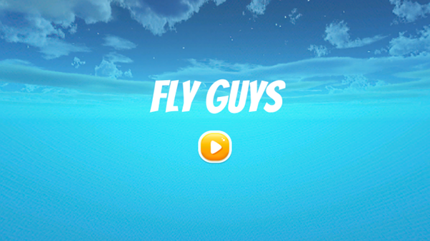
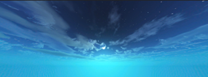
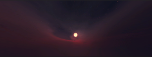
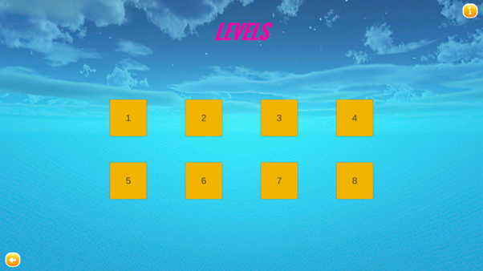
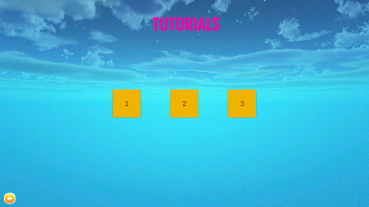
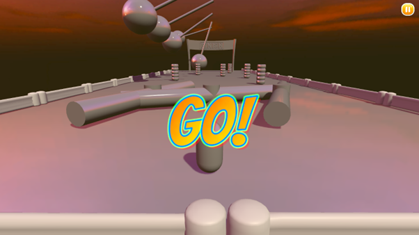
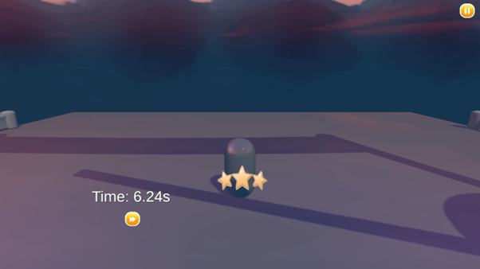
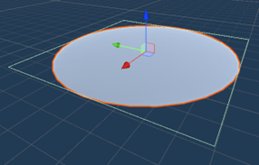
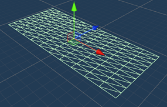

# 🕹️ Fly Guys – 3D Platformer Game in Unity

**Fly Guys** is a 3D single-player platformer inspired by *Fall Guys*, developed in Unity. You compete in a series of increasingly difficult obstacle courses to become the ultimate defender of Grootopia.

Built with Unity, C#, and custom level mechanics, Fly Guys is a time-trial challenge that emphasizes reflexes, timing, and platforming precision.

---

## 🎮 Game Overview

- 🏁 Navigate 8 obstacle-filled levels with increasing difficulty
- 🧠 3 tutorial stages guide new players through mechanics
- ⭐ Star-based performance grading system for each level
- 🧱 Physics-based obstacles: rotators, pendulums, see-saws, bouncing pads, walls
- 🌌 Unique background skyboxes and reflective characters
- 🎵 Sound effects and animated UI prompts enhance immersion

---

## 🧩 Game Structure

| Element     | Details |
|-------------|---------|
| Engine      | Unity 2023.1.0 (Beta) |
| Language    | C# |
| Mode        | Single-player, time trial |
| Controls    | Arrow keys to move, space bar to jump |
| Goal        | Reach the finish line as quickly as possible |

---

## 🖼️ Screenshots

```markdown










```
## 🖼️ Screenshots

### Main Menu


### Sample Level


---

## 🧱 Level Design

- ✅ 3 tutorial levels
- 🟦 Level 1–2: Easy
- 🟨 Level 3–4: Intermediate
- 🟥 Level 5–6: Hard
- 🔥 Level 7–8: Extreme

Each level includes checkpoints and custom difficulty grading. Tutorial levels always award 3 stars. Level 7–8 reward full stars upon any completion.

---

## 🧠 Game Features

- 🔁 Custom collision + physics logic for all obstacles
- 💫 Reflective capsule character with animated UI
- 📊 Star grading system based on time thresholds
- 🔊 Audio feedback for movement and collisions
- ☁️ Unique skyboxes from Fantasy Skybox FREE
- 🧩 GUI and effects from Unity Asset Store packs

---

## 🚧 Known Bugs

- Infinite respawn loop under certain collisions
- Minor physics inconsistencies between editor and build
- Some complex models failed to interact correctly with Unity physics (resolved using default capsule)

---

## 📌 Future Plans

- 🧑‍🤝‍🧑 Add multiplayer or AI opponent modes
- 🎨 Expand skin system (custom colors/models)
- 🗺️ Release additional maps and chapters
- 🧠 Fix current physics bugs and enhance stability

---

## 📂 Project Structure

```
Assets/
├── Scripts/          # Custom movement, obstacle, UI logic
├── Scenes/           # All level and UI scenes
├── Prefabs/          # Modular obstacles and character parts
├── Materials/        # Skybox, reflective material
└── Audio/            # Sound effects and prompts

ProjectSettings/
Packages/
```

---

## 🧾 Credits

- **Fantasy Skybox FREE** – Skyboxes
- **Game GUI Vol1** – Buttons
- **Score and Times – Game Sound Solutions** – Sound FX
- **ObstacleCoursePack** – Reference scripts for rotators, paddles
- All models and final scripts authored or adapted by the team

---

## 🛠 How to Run

1. Open the project in **Unity 2023.1.0 beta**  
2. Load `Assets/Scenes/MainMenu.unity`  
3. Click ▶️ to play from the main menu

---

## 📦 Status

This project was built over 3 months as part of a university capstone. While it's still being improved, it is playable and fully functional in time-trial mode.
